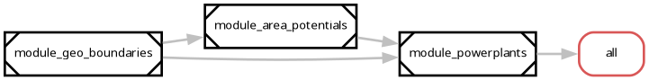

# Modular workflow training

A small example repository showcasing how to connect Modelblocks workflows!


## Overview

Default data processing steps:

1. Shapes are created using the [Geo-boundaries](https://github.com/modelblocks-org/module_geo_boundaries) module.
2. These shapes are used to collect powerplant data within a given region using the [Powerplants](https://github.com/modelblocks-org/module_powerplants) module.

<!-- Example module output -->
<p align="center">
  
  <br>
  <em>Default modules.</em>
</p>


## Getting started

We use [`pixi`](https://pixi.sh/) as our software manager.
Follow their [installation instructions](https://pixi.prefix.dev/latest/installation/) to get started.

Once installed, clone or download this repository.

```shell
git clone git@github.com:modelblocks-org/modular_workflow_training.git
```

Once the code is in your machine, tell `pixi` to install the software dependencies.

```shell
cd modular_workflow_training/
pixi install --all
```

## Executing the workflow

For testing, simply run:

```shell
pixi run snakemake --cores 2  # cores: total CPU cores to give to Snakemake
```

If you want to generate a particular file, just specify it.

```shell
pixi run snakemake --cores 2 resources/geo_boundaries/results/BALTIC/shapes.parquet
```


## `pixi` tasks

These are helpful commands to help you analyse results.


### `rulegraph` and `modulegraph`

These tasks render direct acyclic graphs (DAGs) of the Snakemake rules exectued to obtain results.

By default, these will render `rule all:` in the [Snakefile](./workflow/Snakefile).

```shell
pixi run rulegraph
pixi run modulegraph
```

To graph only the rules needed to produce a particular file, use `--target`:

```shell
pixi run rulegraph --target resources/geo_boundaries/results/BALTIC/shapes.parquet
pixi run modulegraph --target resources/geo_boundaries/results/BALTIC/shapes.parquet
```
